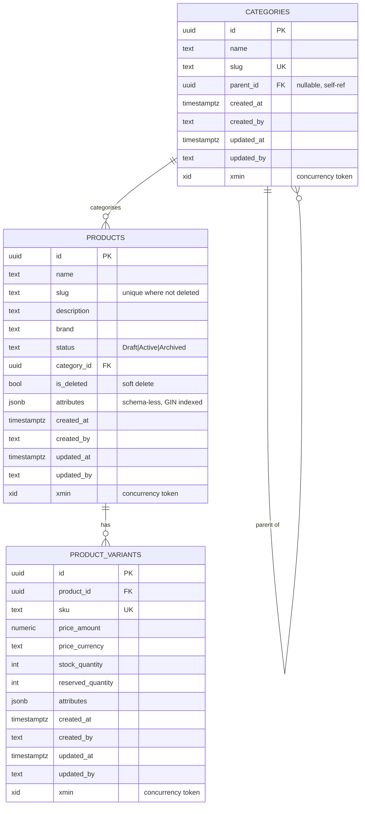

# Database Design — ERD & Indexes

## Entity–relationship diagram

## Design notes

- **Aggregate**: `Product` is the aggregate root; `ProductVariant` rows are written through it. `Category` is a separate aggregate referenced by id.
- **Flexible attributes**: `attributes jsonb` on both products and variants means new fields require **no migration**. Stored as `jsonb` (binary) so it can be indexed and queried by the DB.
- **Money**: stored as an owned value object → `price_amount numeric(18,2)` + `price_currency` (ISO‑4217). Currency is never lost.
- **Soft delete**: `products.is_deleted` + an EF global query filter; deleted products vanish from reads but remain for history/orders.
- **Concurrency**: PostgreSQL system column `xmin` is mapped as the optimistic‑concurrency token and surfaced to clients as an HTTP `ETag`.

## Indexes & constraints

| Table | Index / constraint | Purpose |
|---|---|---|
| `categories` | unique `slug` | human‑readable unique key |
| `categories` | `parent_id` | tree lookups |
| `products` | unique `slug` *filtered* `WHERE is_deleted = false` | unique among live products |
| `products` | `category_id`, `status`, `is_deleted` | common filters |
| `products` | **GIN** on `attributes` | fast `JSONB` containment queries |
| `product_variants` | unique `sku` | global SKU uniqueness |
| `product_variants` | `product_id` | join/lookup by product |
| `product_variants` | `CHECK stock_quantity >= 0` | non‑negative stock |
| `product_variants` | `CHECK reserved_quantity >= 0 AND reserved_quantity <= stock_quantity` | never over‑reserve (DB backstop) |

## Why SQL + JSONB (not NoSQL)

Strong consistency for inventory/pricing demands ACID transactions and row‑level guards — a relational engine's home turf. The one thing relational schemas are weak at — *evolving, sparse, per‑category attributes* — is solved by `JSONB`, which provides document‑style flexibility **inside** the transactional database, with GIN indexing for query performance. This captures the NoSQL benefit (schema flexibility) without giving up the consistency guarantees the domain requires.
